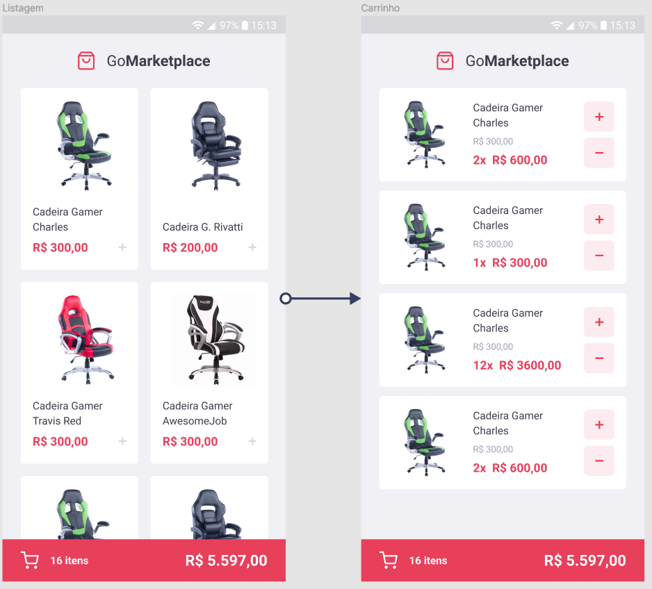

<h1 align="center">
    
</h1>

<p align="center">
  <a href="#execution">Preview</a>&nbsp;&nbsp;&nbsp;|&nbsp;&nbsp;&nbsp;
  <a href="#technologies">Technologies Used</a>&nbsp;&nbsp;&nbsp;|&nbsp;&nbsp;&nbsp;
  <a href="#run">How to run the project</a>&nbsp;&nbsp;&nbsp;|&nbsp;&nbsp;&nbsp;
  <a href="#contribute">How to contribute</a>&nbsp;&nbsp;&nbsp;|&nbsp;&nbsp;&nbsp;
  <a href="#license">License</a>
</p>

<p align="center">
 

  

  
</p>

<br>

## :books: About

GoMarketplace features:

- Lists products from a fake api
- Adds items to a shopping cart
- Displays items in the cart
- Increases the number of items in the cart
- Decrease the quantity of items in the cart
- Displays the total value of the items in the cart

<a id="execution"></a><br>

## :tv: Screen



<a id="technologies"></a><br>

## ⚒️ Technologies Used

- React Native
- Async Storage
- Context API

<a id="run"></a><br>

## 🚀 How to run the project on the Android emulator

- [Configure](https://react-native.rocketseat.dev/android/windows) the emulator to run the project

<br>

- Clone this repository

```
git clone https://github.com/RuthMaria/gostack-reactNative-fundamentals
```

- Install dependencies

```
yarn
```

- Define the connection port with the emulator

```
adb reverse tcp:3333 tcp:3333
```

- Run the project <br>

Terminal 1

```
yarn json-server server.json -p 3333
```

Terminal 2

```
yarn start
```

Terminal 3

```
yarn Android
```

- Run the tests

```
yarn test
```

<br>

## 🎯 How to contribute

- Fork this repository,
- Create a branch with your feature: `git checkout -b my-feature`
- Commit your changes: `git commit -m 'feat: My new feature'`
- Push your branch: `git push origin my-feature`

<a id="license"></a><br>

## :memo: License

This project is under the MIT license. See the file [LICENSE](LICENSE) for more details.

---

<h4 align="center">
    Developed with ❤️ by <a href="https://www.linkedin.com/in/ruth-maria-9b256071/" target="_blank">Ruth Maria</a>
</h4>
